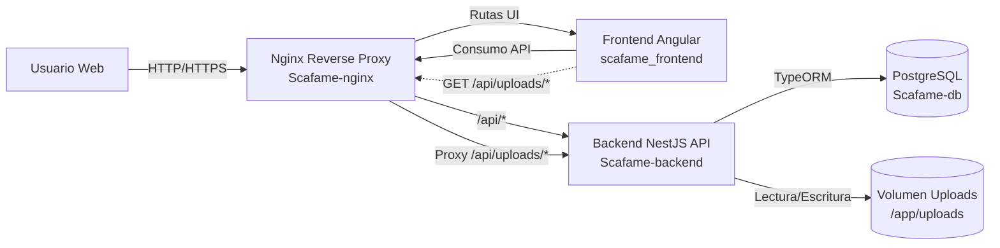
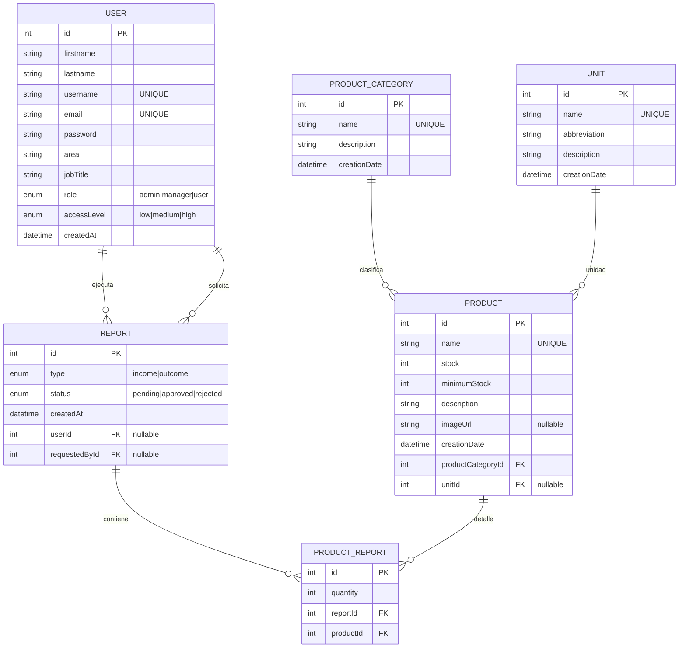

# Diagramas de arquitectura y entidad-relacion - SCAFAME

## 1) Diagrama de arquitectura (alto nivel)

## 2) Diagrama entidad-relacion (base de datos)

## 3) Notas rapidas
- El frontend consume backend a traves de Nginx usando prefijo /api.
- Las imagenes de productos se sirven desde /uploads en backend y deben persistir en volumen.
- PRODUCT_REPORT materializa la relacion N:M entre REPORT y PRODUCT.
- REPORT mantiene dos relaciones opcionales a USER: quien ejecuta y quien solicita.
